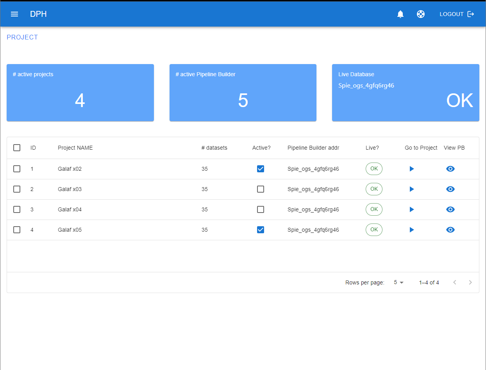
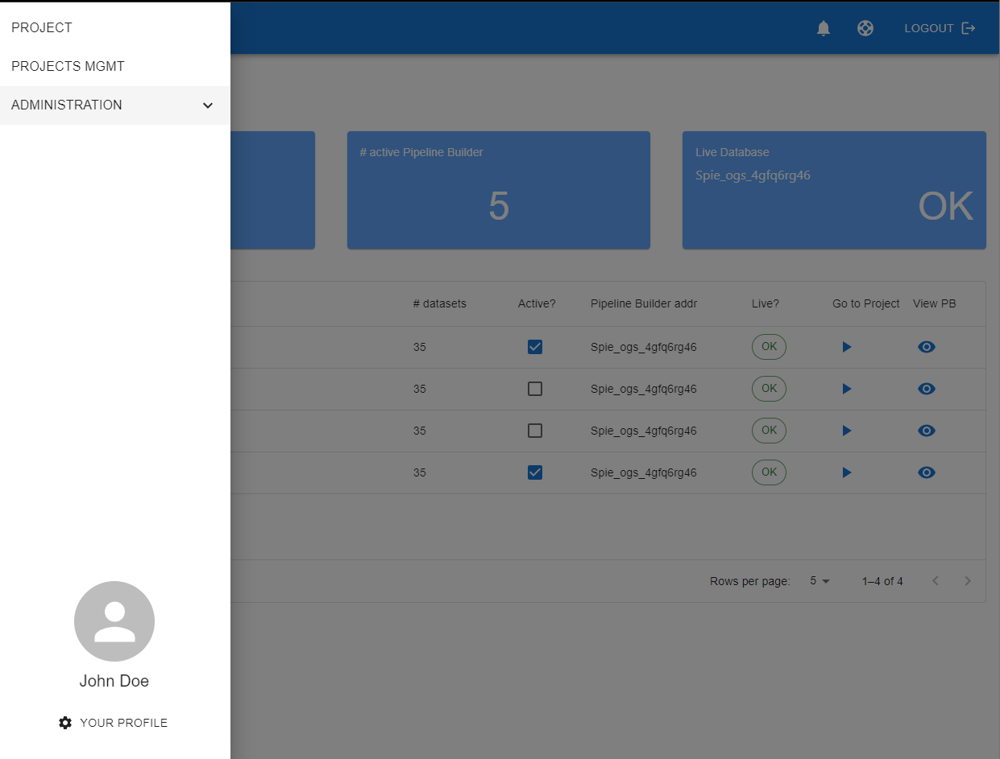
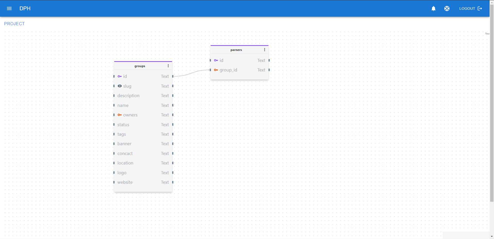

# Stack

Chaque application est lancée dans son propre container Docker.

#### - Front
- React
- MUI
- Tailwind
- etc..

#### - Back
- ExpressJS ( possible Adonis )
- Sequelize
- Joi
- etc..

#### - Reverse Proxy
- Nginx
- ClamAV
- etc..

## Preview

Les captures d'écran si dessous ont été crées sur une maquette réalisée avec React et sa dépendance MUI, entre autres choses.

- Exemple Dashboard

- Exemple Menu 

- Exemple JEUX DE DONNÉES  

# 

## Temps de réalisation

Nous partons du principe qu'il y a déjà l'accès à un serveur mail. 
La mention "CRUD" peut aller bien au-dela du terme habituel et inclure l'upload de fichier par exemple.

0. Structuration et Documentation de l'application **5 jours** 
    - structure de l'app back (schéma divers, db models, swagger, mocha etc.. )
    - structure de l'app front ( tailwind, reducers etc..)

1. Dashboard **34 jours**
    - Administration CRUD **15 jours** ( ROLE et USER sont 2 CRUD différents ) ( +1 jours inclus pour la création du ACL middleware )
    - Refactorisation de l'interface **5 jours**
    - Projet CRUD ( "définition" est un CRUD ) **6 jours** ( +1 jour inclus pour la recherche avancée )
    - Glossaire CRUD **3 jours**
    - User ( login, logout, delete, mail, reducer etc.. ) **5 jours**

2. Options : JEUX DE DONNÉES **12 jours**
    - Réalisation de l'interface **7 jours**
    - Création des routes back **5 jours**

3. Déploiement & Sécurité **5 jours**
    - Scripts [ docker-compose.yml, Dockerfiles, .env, sh, etc.. ] **2 jours**
    - Antivirus : ClamAV **1 jours**
    - base de données & test **2 jours**

5. Coût global
    - 56 jours hommes
    - 550€ TJM
    - 30800 TTC

## Questions

- "The System Management UI shall NOT: Provide an API dataset access" mais sur le schéma 4, la WEB UI communique directement avec postgres **ce qui n'est pas possible**.

- Trace/Versioning : 
Le versionning de document doit se faire au niveau binaire ? 
Doit-on juste enregistrer plusieurs fichiers et stocker la chronologie d'envoi ?
Doit-on directement éditer le document en ligne ?

- Faire de la recherche en fulltext sous-entend que tout le document est aussi en BDD au format texte ( mots indexés ) donc l'utilisation d'un OCR ? 

- Créer dynamiquement des rôles ? ACL par projet ?

- 1 projet = Une BDD ?

- Quel est le rôle exact du pipeline builder ?

